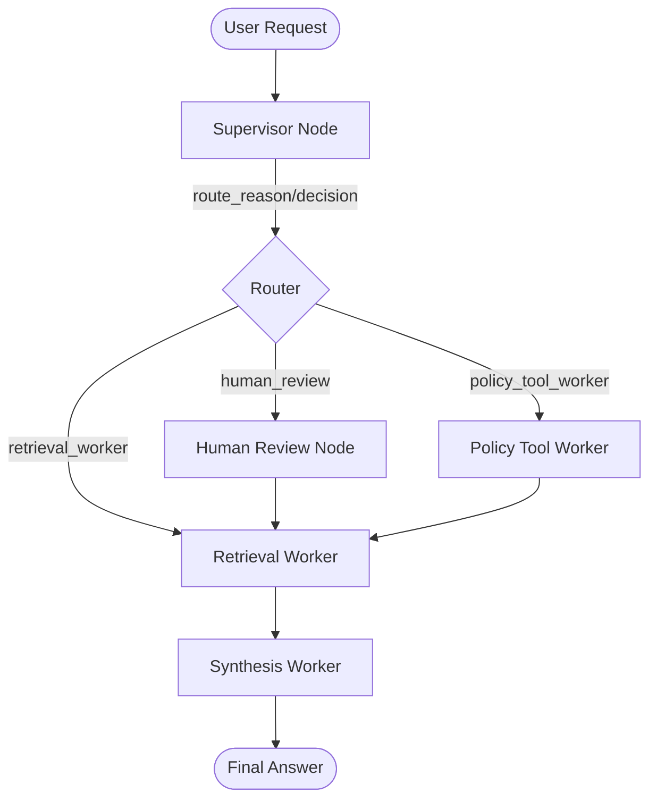

# System Architecture — Lab Day 09

**Nhóm:** 63
**Ngày:** 2026-04-14  
**Version:** 1.0

---

## 1. Tổng quan kiến trúc

Hệ thống được xây dựng theo mô hình **Supervisor-Worker** sử dụng **LangGraph**. Supervisor đóng vai trò là bộ não điều phối, phân tích câu hỏi người dùng để quyết định gọi worker phù hợp (Retrieval, Policy Tool hoặc Human Review).

**Pattern đã chọn:** Supervisor-Worker  
**Lý do chọn pattern này (thay vì single agent):**
- **Sự tách biệt rõ ràng (Separation of Concerns):** Mỗi worker chỉ phụ trách một nhiệm vụ chuyên biệt (tìm kiếm, kiểm tra chính sách, tổng hợp), giúp code dễ bảo trì hơn.
- **Khả năng quan sát (Observability):** Trace ghi lại rõ lý do routing (`route_reason`), giúp dễ dàng debug khi hệ thống chọn sai worker.
- **Tính mở rộng:** Dễ dàng thêm các workers mới hoặc MCP tools mà không làm ảnh hưởng đến logic chính của supervisor.

---

## 2. Sơ đồ Pipeline

---

## 3. Vai trò từng thành phần

### Supervisor (`graph.py`)

| Thuộc tính | Mô tả |
|-----------|-------|
| **Nhiệm vụ** | Phân tích query và xác định worker chịu trách nhiệm xử lý. |
| **Input** | `task` (câu hỏi từ user). |
| **Output** | `supervisor_route`, `route_reason`, `risk_high`, `needs_tool`. |
| **Routing logic** | Sử dụng keyword-based classification (ban đầu) kết hợp với các flag rủi ro. |
| **HITL condition** | Trigger khi phát hiện mã lỗi `err-` hoặc các keywords khẩn cấp rủi ro cao. |

### Retrieval Worker (`workers/retrieval.py`)

| Thuộc tính | Mô tả |
|-----------|-------|
| **Nhiệm vụ** | Tìm kiếm thông tin chứng cứ từ ChromaDB. |
| **Embedding model** | `all-MiniLM-L6-v2` (SentenceTransformer). |
| **Top-k** | 5 chunks. |
| **Stateless?** | Yes. |

### Policy Tool Worker (`workers/policy_tool.py`)

| Thuộc tính | Mô tả |
|-----------|-------|
| **Nhiệm vụ** | Kiểm tra các quy tắc đặc biệt và gọi các external tools thông qua MCP. |
| **MCP tools gọi** | `search_kb`, `get_ticket_info`. |
| **Exception cases xử lý** | Flash Sale refund policy, Level 3 Access control requirements. |

### Synthesis Worker (`workers/synthesis.py`)

| Thuộc tính | Mô tả |
|-----------|-------|
| **LLM model** | `gpt-4o-mini` (OpenAI). |
| **Temperature** | 0 (để đảm bảo tính chính xác và nhất quán). |
| **Grounding strategy** | Trả lời dựa trên DUY NHẤT các chunks/policy result được cung cấp trong state. |
| **Abstain condition** | Nếu thông tin trong Context rỗng hoặc không liên quan đến câu hỏi. |

### MCP Server (`mcp_server.py`)

| Tool | Input | Output |
|------|-------|--------|
| search_kb | query, top_k | danh sách chunks và sources |
| get_ticket_info | ticket_id | thông tin chi tiết về ticket (priority, status, v.v.) |

---

## 4. Shared State Schema

| Field | Type | Mô tả | Ai đọc/ghi |
|-------|------|-------|-----------|
| task | str | Câu hỏi đầu vào | Supervisor đọc |
| supervisor_route | str | Worker được chọn | Supervisor ghi, Router đọc |
| route_reason | str | Lý do route | Supervisor ghi, Trace log |
| retrieved_chunks | list | Evidence từ retrieval | Retrieval ghi, Synthesis đọc |
| policy_result | dict | Kết quả kiểm tra policy | Policy_tool ghi, Synthesis đọc |
| mcp_tools_used | list | Tool calls đã thực hiện | Policy_tool ghi |
| final_answer | str | Câu trả lời cuối | Synthesis ghi |
| confidence | float | Mức tin cậy | Synthesis ghi |
| history | list | Lịch sử các bước xử lý | Tất cả nodes ghi |
| workers_called | list | Danh sách worker đã chạy | Mỗi worker ghi |

---

## 5. Lý do chọn Supervisor-Worker so với Single Agent (Day 08)

| Tiêu chí | Single Agent (Day 08) | Supervisor-Worker (Day 09) |
|----------|----------------------|--------------------------|
| Debug khi sai | Khó — không rõ lỗi ở giai đoạn nào | Dễ — biết chính xác worker nào trả kết quả sai |
| Thêm capability mới | Phải sửa toàn bộ system prompt | Chỉ cần thêm worker hoặc tool MCP mới |
| Routing visibility | Không có | Rõ ràng nhờ `route_reason` và `workers_called` |
| Performance | Agent có thể bị "confused" khi task phức tạp | Supervisor tập trung vào phân loại, Worker tập trung vào thực thi |

**Nhóm điền thêm quan sát từ thực tế lab:**
Hệ thống Multi-agent cho phép xử lý các tình huống phức tạp (như gq09 - yêu cầu cả SLA và Access Control) bằng cách gọi lần lượt nhiều worker hoặc tool, điều mà một Single Agent thường hay bỏ sót các chi tiết nhỏ.

---

## 6. Giới hạn và điểm cần cải tiến

1. **Routing Logic:** Hiện tại dùng keyword đơn giản, có thể cải tiến bằng cách dùng LLM làm Classifier cho Supervisor.
2. **MCP Client:** Hiện đang gọi model MCP trực tiếp thông qua import, có thể chuyển sang dùng thư viện `mcp` với transport thực (stdio/http).
3. **Latency:** Việc gọi nhiều worker (retrieval xong đến policy check) làm tăng độ trễ so với Day 08. Có thể tối ưu bằng cách chạy song song một số nodes.
